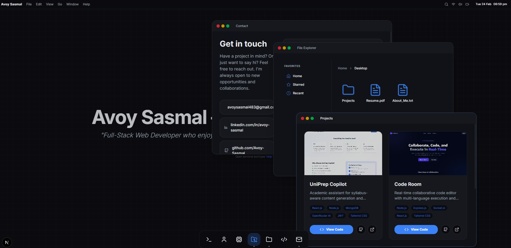
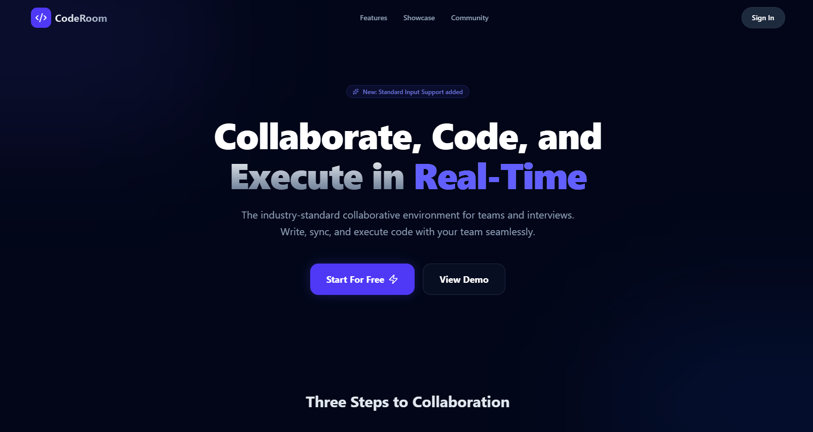
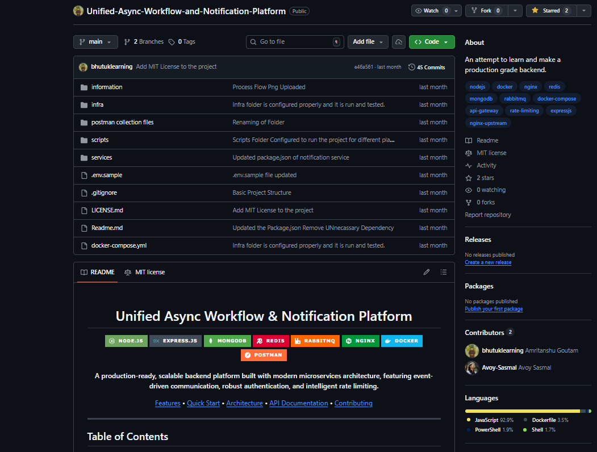
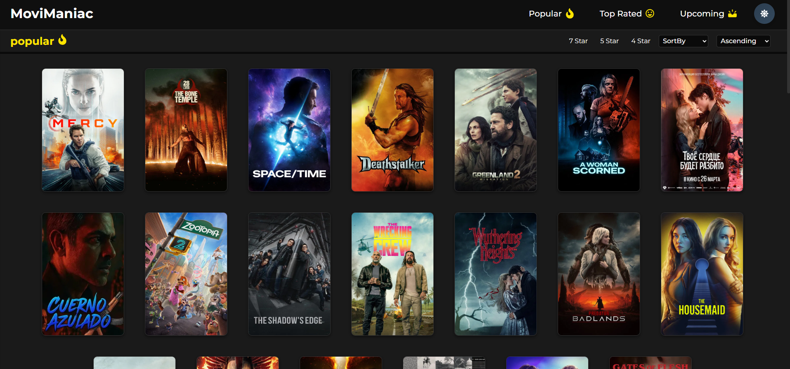

# 🖥️ OS-Inspired Developer Portfolio

A sleek, interactive personal portfolio designed with a modern operating system interface. This project features a window management system, a functional dock, and several built-in "apps" to showcase my skills and projects.



## ✨ Key Features

- **🪟 Window Management**: Open, minimize, maximize, and focus multiple windows (About, Skills, Projects, etc.).
- **⚓ Interactive Dock**: Animated macOS-style dock for quick access to system applications.
- **🐚 Functional Terminal**: A command-line interface to explore project details.
- **📁 File Explorer**: Navigate through project structure and assets.
- **🎨 Glassmorphic Design**: Modern UI with acrylic blur effects and smooth animations.
- **📱 Fully Responsive**: Optimized for both desktop and mobile viewing experiences.

## 🛠️ Tech Stack

- **Framework**: [Next.js 15](https://nextjs.org/) (App Router)
- **Library**: [React 19](https://react.dev/)
- **Styling**: [Tailwind CSS 4](https://tailwindcss.com/)
- **Animations**: [Framer Motion](https://www.framer.com/motion/)
- **State Management**: [Zustand](https://github.com/pmndrs/zustand)
- **Icons**: [Lucide React](https://lucide.dev/)

## 📸 Showcase

| Project | Preview |
| :--- | :--- |
| **CodeRoom** |  |
| **Unified Async Notification** |  |
| **UniPrep** |  |
| **Movie App** |  |

## 🚀 Getting Started

### Prerequisites

- Node.js (Latest LTS version recommended)
- npm or pnpm

### Installation

1. Clone the repository:
   ```bash
   git clone https://github.com/Avoy-Sasmal/updated-portfolio.git
   ```

2. Install dependencies:
   ```bash
   npm install
   ```

3. Run the development server:
   ```bash
   npm run dev
   ```

4. Open [http://localhost:3000](http://localhost:3000) in your browser.

## 📄 License

This project is licensed under the MIT License - see the [LICENSE](LICENSE) file for details.

---
Developed with ❤️ by [Avoy Sasmal](https://github.com/Avoy-Sasmal)
